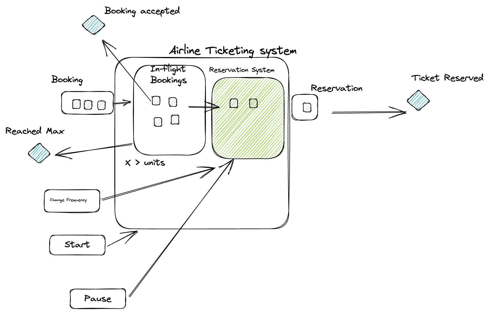

# Fictional Ticketing System
An ticketing system in NodeJS with event based architecture.

## Requirements and Rules
* In flight bookings has a maximum capacity of N units ( Default 10).
* Booking are processed in order.
* Booking should contains the following.
  * Unique booking Id
  * Name of the primary person who made the booking (Booking name)
  * Time is was accepted
* When booking is accepted/added to in-flight bookings, an event (BOOKING_ACCEPTED) should be emitted with bookingName, bookingId and Destination.
* Reservation and booking queuing process will be started concurrently.
* Reservation system can be paused/restart at anytime.
* To prevent the system is getting overloaded, the reservation system can process the booking based on it's system contraints. It can be improved or reduced based on the resource capacity. By default, it can process a booking within 250 ms.
* The reservation system capacity can be altered/configured at any time. i.e. The booking processing time can be increased/decreased after the reservation system starts the processing.
* Once In-flight booking system reaches its max capacity N, any new coming bookings should not be accepted. It should emit an event 'MAX_BOOKING_REACHED' with booking name.
* Once reservation is processed 'RESERVATION_COMPLETED' event should be emitted with bookingId, booking name , booking accepted time and reservation completedTime.

## API
* `createBooking(bookingName)` 
* `getInFlightBookings()` - Returns all bookings as an array/list which has not processed/reserved yet
* `pauseReservation()` - Stop the reservation but the system accept new bookings until max capacity - N
* `changeReservationFrequency(frequency)` - Change the frequency accepts a number in miliseconds

## Design
 Implement the system in test driven design with event based system considering the evolutionary architecture. The business requirements can be changed frequently hence the system should be able to accept the changes often.

 ## Notes
This is not a real business requirement. The intension is to illustrate the TDD approach for fast changing business requirement which is not well defined in the first run.
